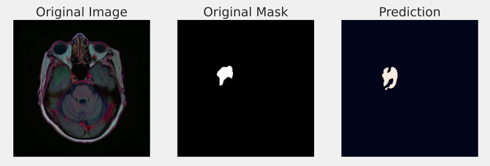
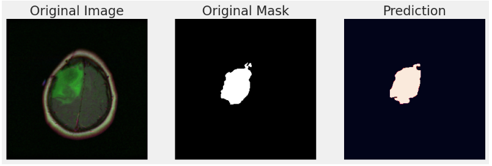

# Brain Tumor Segmentation

## Dataset Link: https://www.kaggle.com/datasets/mateuszbuda/lgg-mri-segmentation

## Kaggle Notebook: https://www.kaggle.com/code/shasan7/brain-mri-segmentation-unet-base

With help of TensorFlow and its high-level API Keras, we **defined the U-Net architecture from scratch** for Brain Tumor Segmentation , and also defined the metrics to monitor loss and performance.

The model was trained for 100 epochs using a batch size of 8, achieving **Dice Socre of 90.14 % along with a 82.94 % IoU**. We also augmented the training set with random shift, shear, zoom and horizontal flip before feeding to the model. Following are some training samples after augmentation:

## Model's Mask Predictions:

## Training & Validation Dice, IoU and Loss:

